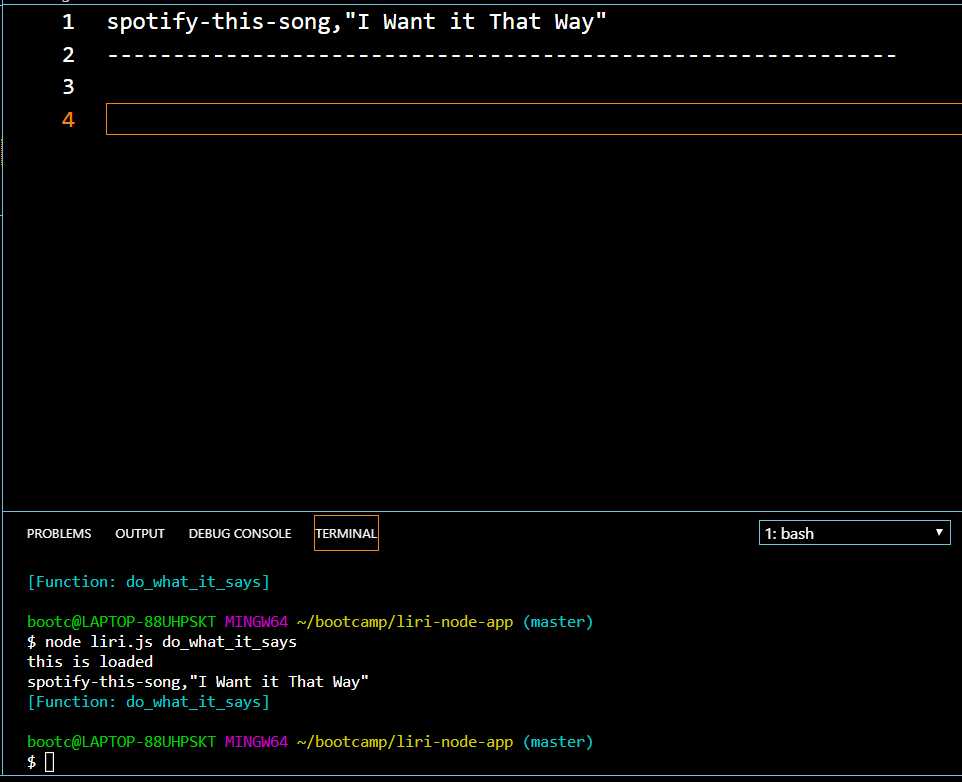

# liri-node-app

The purpose of this app is to allow the user to query for songs, concerts and movies. The following are the query details..

Spotify - Artist, Songs, A Preview Link, Album the song is on.

Concert Events - Venue Name, Location, Date of the event.

Movies - Title, Year of Release, Ratings, Country, Language, Plot and the Actors.

The following API's and libraries were used.

Spotify
Bandsintown
OMDB movie library
Moment
Axios
dotenv
fs

The following are screen shots of executed commands

